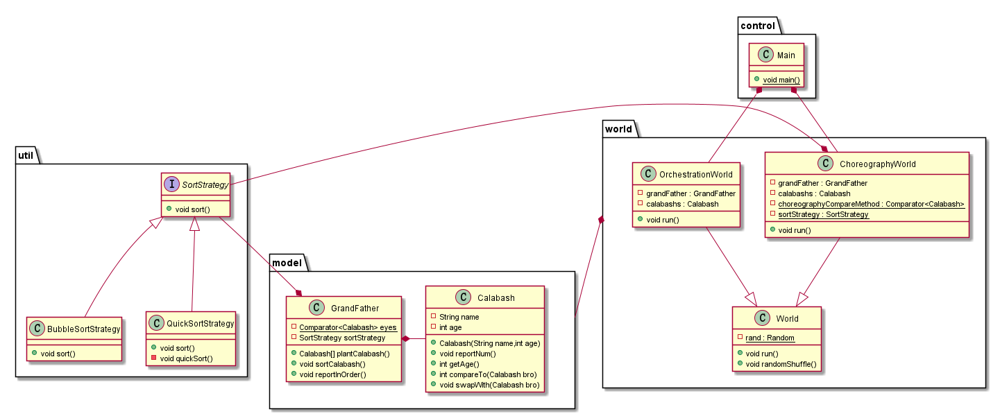

# 优雅的葫芦娃排序

## 代码结构




## 设计思路

对上一次作业的代码进一步抽象得出了`control`、`model`、`world`、`util`的四个包的结构

### model package

model中包含了葫芦娃类和爷爷类

葫芦娃类引入了`Comparable`接口用于葫芦娃在协作方式下的比较

爷爷类相比于上一次作业在排序上做了[调整](#util package)

### util package

util中主要实现了排序算法的抽象

考虑到排序算法需要便于替换，且要能在Choreography和Orchestration两种方式（主要是比较方式的不同）下使用，因此为了降低耦合度和提高代码复用，设计时采用策略模式进行设计

首先定义了`SortStrategy`接口，其他的具体排序策略类（如`QuickSortStrategy`）需要先引入`SortStrategy`,并重载sort方法

具体要排序的对象可以通过传入`Comparator<Calabash>`类型的比较方式来区分Choreography和Orchestration

例如爷爷类中

```java
	private static Comparator<Calabash> eyes = new Comparator<Calabash>(){
        @Override
        public int compare(Calabash a,Calabash b){
            return b.getAge() - a.getAge();
        }
    };

    private SortStrategy sortStrategy = new BubbleSortStrategy();
```

通过静态的`eyes`进行比较，排序策略可在运行时更换，仅需要对sortStrategy赋一个排序策略即可

### world package

world用于实现葫芦娃排序的Choreography和Orchestration方式（两个宇宙的法则不同）

World作为一个基类，包含了两个方法run和randomShuffle，分别控制着宇宙的运行和熵增（对葫芦娃随机排序）

`ChoreographyWorld`和`OrchestrationWorld`继承了`World`并重载了各自的run方法

作为两个平行宇宙，他们各自存在着爷爷和七个葫芦娃

在ChoreographyWorld中，葫芦娃之间的比较通过自身进行（而不是爷爷来比较），因此这个世界定义了一个比较规则

```java
	private static Comparator<Calabash> choreographyCompareMethod = new Comparator<Calabash>(){
        @Override
        public int compare(Calabash a,Calabash b){
            return a.compareTo(b);  //通过葫芦娃自身进行比较
        }
    };

```

同样的，排序策略也是易于更换，并且可在运行时更换的：

```java
private static SortStrategy sortStrategy = new BubbleSortStrategy();
```


### control package

control里控制了两个世界的创建和运行

按理说应该是并行的，但......


## 如何编译运行此项目

```
chcp 65001
javac -d out control/*.java model/*.java util/*.java world/*.java
java -classpath out control.Main
```

