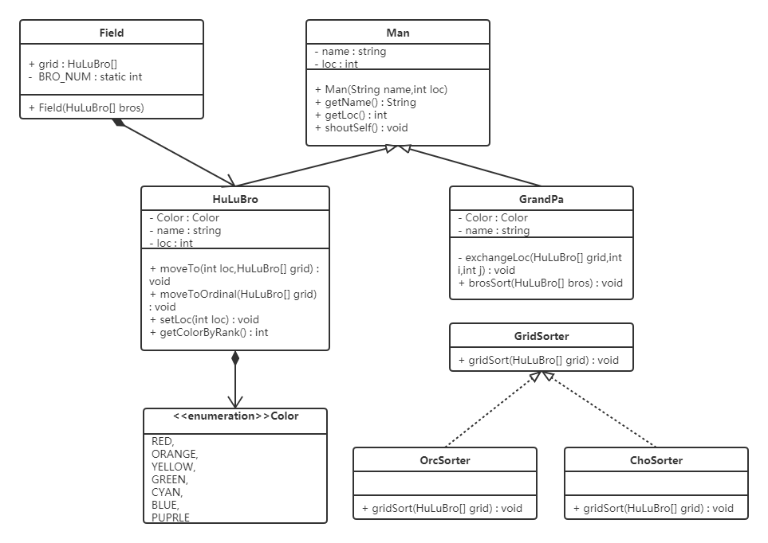

## OOAdvanced

#### 171860640 程珂

1. 本次作业中使用了以下的Java机制

   - **包**：本次作业源代码存放在 `./src/cn/edu/nju/kecheng/java/advancedoop/` 目录下，包名为：`cn.edu.nju.kecheng.java.advancedoop`

   - **构造器**：在本次作业中，`Man`，`HuLuBro`，`GrandPa`，这三个类都有自己的构造器，以`HuLuBro`为例：

     ```java
     HuLuBro(Color color){
             super(color.toString(), color.ordinal());
             this.color=color;
         }
     ```

   - **修饰符**：在这次作业中，所有类的成员变量都有相应的修饰符

   - **静态变量**与**静态块**：在 `Field` 类中有静态成员变量 `BRO_NUM`，用来记录葫芦兄弟的个数，并在静态块中对其进行初始化

     ```java
     static public int BRO_NUM;
         static{
             BRO_NUM=Color.values().length;
         }
     ```

   - **接口**：本次作业设计了`GridSorter` 接口，`ChoSorter` 和 `OrcSorter` 是它的具体实现

2. 本次作业中的类图如下：

   

   本次作业中共设计了7个类(Main 和 Color不算入)，分别是：

   - Man：基础类，有名字`name` 和 位置 `loc` 两个成员变量，提供了获取位置和名字还有打印自身名字和所在位置的`shoutSelf()`方法。

   - HuLuBro：葫芦娃类，新增了私有成员变量`color`，并且将自身的位置和名字初始化为color的顺序和名字，提供了移动到既定位置的方法，可以在战场中找到自己的位置，并与当前占据该位置的葫芦娃交换位置。

   - GrandPa：👴类，本次作业中👴并不加入战场，所以位置`loc` 初始化为 `-1`。

     ​					👴类使用选择排序(可替换为其他的排序算法)的方式实现了对一组葫芦兄弟进行排序的`broSort()` 方法

   - Field：战场类，随机初始化各个葫芦兄弟的位置，并用一个数组保存了对每个葫芦兄弟的引用(Field中数组的下标和葫芦兄弟所在的位置保持相同)

   - GridSorter：对战场中葫芦娃进行排序的接口

   - OrcSorter：以 `orchestration` 方式，通过创建`Grandpa` 类的对象，调用其 `broSort()` 方法对战场中的葫芦兄弟进行排序以实现 `GridSorter`接口的类

   - ChoSorter：以`choreography` 方式，通过调用战场中每个葫芦娃自己的 `moveToOrdinal()` 方法以实现`GridSorter` 接口的类


