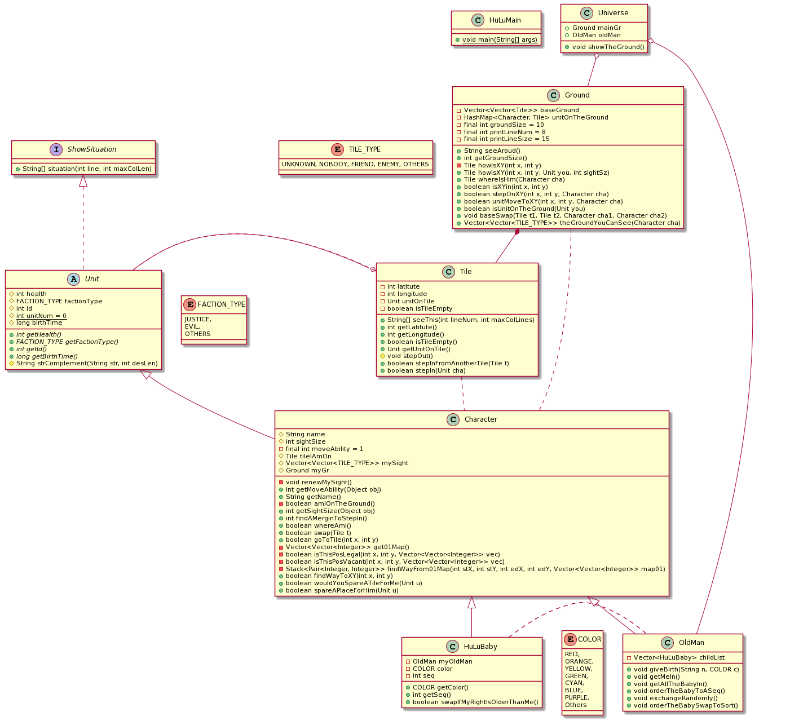

# 葫芦娃 作业三 实现思路

## Update Log 2020/9/27

+ 使用了Interface接口规范了“输出本类内信息”的行为，并对原有的输出地块情况时无法动态绑定每个不同单位类的缺陷进行了修复；优化了输出地块信息的细节
+ 调整了部分类内成员的访问控制
+ 从原Character类内抽象出了抽象类Unit（单位）的概念，包含血量、阵营等，并将原本仅存在于HuLuBaby内的birthTime概念抽象进Unit类内
+ 为每个Unit类分配唯一的id
+ Unit类内增添了静态成员变量unitNum，以此记录总共生成的单位数量，且以此来分配每个对象的id
+ 在创造时为每个HuLuBaby分配其颜色与顺序，该顺序与全局的id区别，是相对于其每一个“亲生老爷爷”而言的
+ 将文件进行了简单的分包，单位及其相关派生类在Units包中，地块（Tile）和场地（Ground）以及其相关的enum在Ground包中，Universe类与main类相对来说属于控制包中，接口单独在一个包内
+ 在Universe内添加了静态块，简要描述了Universe诞生前的情况
+ 修正了交换、移动位置需要提供“自身地块”信息的逻辑缺陷
+ 使用UML图对程序的结构进行了概括

### 可能的改进方向
在人物Character类内添加名为“memory”的记忆类，其包含一切临时的记忆，包括地形、单位列表、自身位置等——且其不再以引用方式存储，而存取一份拷贝，避免错误的访问或修改

## 上次作业描述

---

## 概述 - 自顶向下

+ 进入主程序入口
+ 新建一个Universe类
  + Universe初始化Ground
    + Ground是一个场地类，维护一个Tile类的二维数组
      + Tile类是一个包含位置属性、包含人物单位Character的地块类
        + Character是一个人物类，包括人物的血量、姓名、视野能力、移动能力等属性
          + 人物类可以访问Ground类获取其位置以及视野范围的地块或人物信息
          + 人物类可以向视野范围内的人物类交互，例如互相判断敌友，交换位置，请求让路，命令移动等
          + 人物类向Ground类请求自己移动能力的范围内的移动，Ground类会进行移动合法性检查
          + 人物类可以向视野内可以看到的位置寻路，如果寻路成功，可以自行向Ground类请求移动并移动到该节点
        + Tile类有向外界提供地块及地块内单位相关信息的接口
      + Ground类维护一个单位到地块的映射表，也即可以在常数时间内返回每个单位的位置——这一点对于一个真实的场地是很容易理解的
      + Ground类提供一个对场地信息全局描述的接口，在此程序中该接口被Universe调用，从而在控制台显示场地信息
      + Ground类接收单位向其发送的移动请求，如果合法，则该单位成功移动，Ground类更新其内容
    + Universe诞生一个老爷爷OldMan类对象
      + 老爷爷类继承自Character类
      + 老爷爷类提供接生葫芦娃HuluBaby的接口
        + HuluBaby继承自Character类
        + 其维护一个向老爷爷的索引
        + 其拥有出生日期属性，可以标志其年龄，从而在排序时可以使用年龄区分
        + 葫芦娃类在构造时使用系统时间初始化出生日期
      + 老爷爷类维护一个葫芦娃的名单列表
      + 通过名单列表老爷爷类可以向葫芦娃类发送移动命令、自行排序命令
    + Universe可以对自身的Ground进行展示，效果详见程序运行时的控制台
  + Universe中的老爷爷使自己走上场地
  + Universe中的老爷爷给7个葫芦娃接生
  + Universe中的老爷爷命令7个葫芦娃尝试走上场地
    + 7个葫芦娃分别尝试从场地边缘走上场地
  + Universe中的老爷爷命令7个葫芦娃走成有序的一排
    + 7个葫芦娃分别向场地请求视野，之后自行寻路，尝试走到目标位置
  + Universe中的老爷爷命令7个葫芦娃相互随机交换以打乱顺序
  + Universe中的老爷爷命令7个葫芦娃自行商量进行排序，均认为自身位置无误时结束
    + 葫芦娃互相询问对方的年龄，如果年龄大的在自己右侧，则交换位置，并返回尚未确定位置标志，直到全部有序
  + Universe向外界展示自身ground的状态

## 程序运行请注意

+ 为了程序运行效果，请将控制台缓冲区大小调到8000000上下，或者导出到文件
+ 将程序中部分显示方法注释，可以直接看到各个结果图
+ 如不注释，则每次移动操作基本都会输出到控制台进行显示
