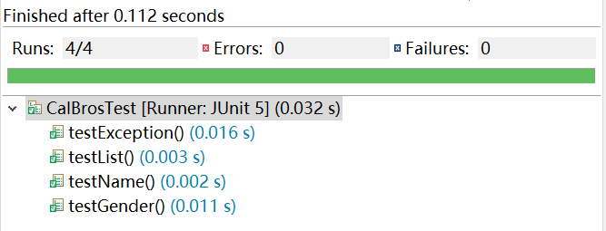

# 第九次作业-测试

> 171180526 刘晗桐

### 测试类说明

基于上次`8-Generics`新建了一个类`CalBrosTest`用于测试`CalBros`类

一共有以下几个测试单元

`testList`：测试类中存储葫芦娃的数据结构是否为`List`

`testName`：测试姓名是否符合规范

`testGender`：测试性别是否为二元之一

`testException`：测试当传入参数为`-1`时，是否会报错

### 测试结果

### 参考

[How to use JUnit in Eclipse](http://www.cse.chalmers.se/edu/year/2012/course/TDA566/juniteclipse.html#:~:text=In%20Eclipse%2C%20you%20create%20a,name%20of%20your%20test%20case.)

[Annotation Type Test](http://junit.sourceforge.net/javadoc/org/junit/Test.html)