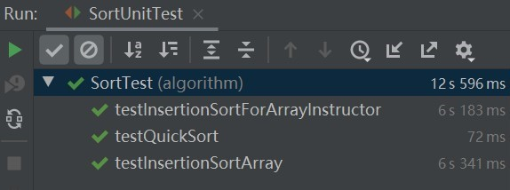

# 测试作业说明

因为目前葫芦娃作业中最核心的部分是排序算法，所以我考虑对`algorithm`包的`Sort`类执行单元测试，并限定执行的时间为100ms，测试类的核心单元测试函数如下，其中`createIntegerArrayList(int capacity)`是一个生成指定长度的随机`ArrayList<Integer>`的函数，返回值为生成的`ArrayList`：

```java
    /**
    * Method: insertionSort(ArrayList<T> array)
    */
    @Test(timeout = 10000)
    public void testInsertionSortArray() throws Exception {
        ArrayList<Integer> arrInt = createIntegerArrayList(100000);
        int arrLength = arrInt.size();
        Sort.insertionSort(arrInt);
        for(int i = 1; i < arrLength; ++i){
            assertTrue("Some pair is inversed!",
                    arrInt.get(i-1) <= arrInt.get(i));
        }
    }

    /**
    * Method: insertionSort(ArrayList<T> array, E instructor)
    */
    @Test(timeout = 10000)
    public void testInsertionSortForArrayInstructor() throws Exception {
        ArrayList<Integer> arrInt = createIntegerArrayList(100000);
        int arrLength = arrInt.size();
        Sort.insertionSort(arrInt, new Comparator<Integer>() {
            @Override
            public int compare(Integer o1, Integer o2) {
                return o1 - o2;
            }

            @Override
            public boolean equals(Object obj) {
                return false;
            }
        });
        for(int i = 1; i < arrLength; ++i){
            assertTrue("Some pair is inversed!",
                    arrInt.get(i-1) <= arrInt.get(i));
        }
    }

    /**
     * Method: quickSort(ArrayList<T> array, int left, int right)
     */
    @Test(timeout = 1000)
    public void testQuickSort() throws Exception{
        ArrayList<Integer> arrInt = createIntegerArrayList(100000);
        int arrLength = arrInt.size();
        Sort.quickSort(arrInt, 0, arrLength - 1);
        for(int i = 1; i < arrLength; ++i){
            assertTrue("Some pair is inversed!",
                    arrInt.get(i-1) <= arrInt.get(i));
        }
    }
```

测试的核心思路是随机生成一个长度为100000的`Integer`类型的`ArrayList`，对其中内容进行随机填充，然后调用`Sort`类中的方法执行升序排序，最后遍历排序后结果确定是否排序正确。同时，`@Test`注解设定`timeout`属性。经过调试，两个`insertionSort`需要设定`timeout=10000`方可通过，而对`quickSort`仅需设定`timeout=1000`。如下图所示，是一次单元测试的执行结果：



由此确认了各个排序算法的正确性，并验证了快速排序可以更高效地完成排序的结论。

控制台输出如下所示：

```shell
@BeforeClass
Begin Unit Test for Sort
End Unit Test for Sort
Begin Unit Test for Sort
End Unit Test for Sort
Begin Unit Test for Sort
End Unit Test for Sort
@AfterClass
```

