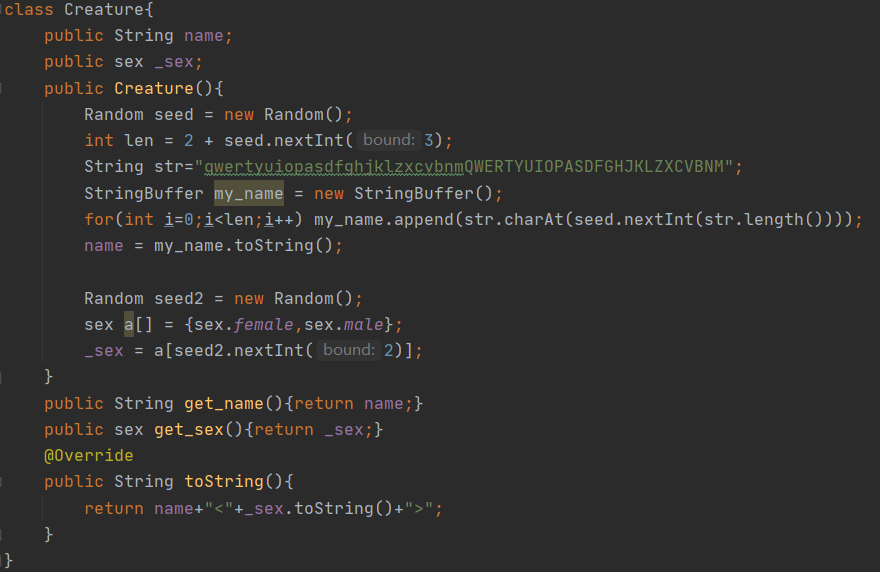
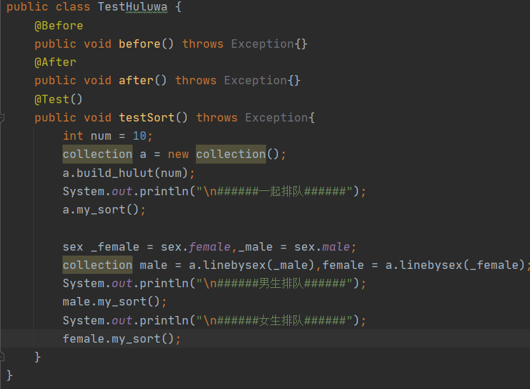
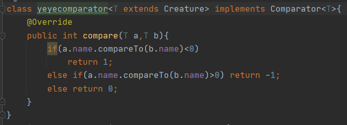
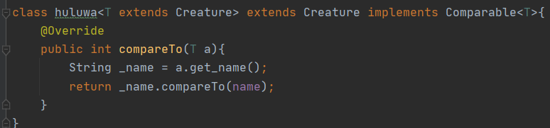
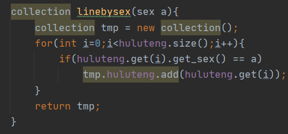
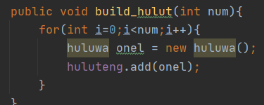
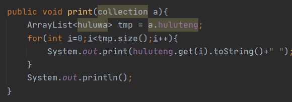

# 泛型

构建了Creature类型对葫芦娃进行了抽象，同时对yeye排序和葫芦娃进行了一个泛型化。

这样爷爷和葫芦娃只要是生物就可以对其进行比较和排序。同时姓名和性别的初始化也单独抽象出来了，这样huluwa类内只需要专心自己作为葫芦娃与其他生物的不同之处。而yeye类的泛型化，使得爷爷在面对例如穿山甲与其他小动物时也可以帮助他人比较排序。

好处在于之后拓展的时候，更加有利于代码的复用。并且爷爷的功能得到了强化，且葫芦娃可以专心做自己的特长（比如可以让自己从葫芦藤里蹦出来，但其他生物做不到）。

# 测试

编写了测试类TestHuluwa，主要针对collection的以下几个功能进行了测试。

#### 1、排序

排序有两种实现分别为葫芦娃之间自己排序和爷爷帮葫芦娃排序，为了以示区分，两种排序一个是逆序，一个是顺序。

爷爷排序：

葫芦娃排序：

#### 2、按性别分列

将葫芦娃按照他们的性别分成两个子集。

#### 3、构建葫芦藤

为葫芦藤挂上num个葫芦娃。

#### 4、打印葫芦藤

将葫芦藤的信息完整地输出。

