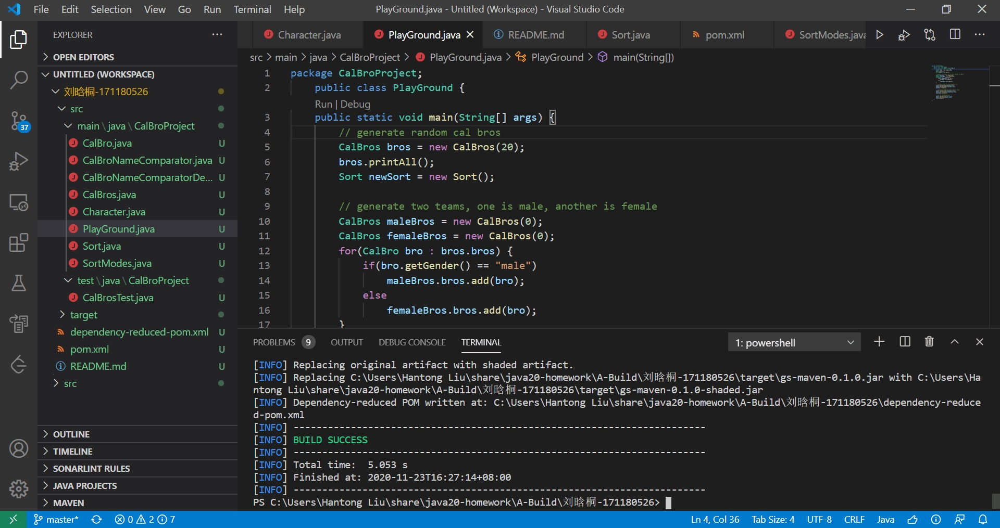

# 作业
- 使用第三方库（Jar）增强你的葫芦娃
主要使用了Google的Guawa库改写了几处地方，增强了代码的可读性
1. 使用Guawa提供的Preconditions检查了几处函数的参数，而不是使用可读性较差的throw Exceptions
```java
// Pre Guawa
CalBros(int number) throws IllegalArgumentException {
	if(number == -1) {
		throw new IllegalArgumentException();
    ...
}
// After Guawa:
CalBros(int number) {
	Preconditions.checkArgument(number != -1, "Invalid number argument!");
    ...
}
```
2. 在单元测试代码中使用Range类来定义需要检查的范围
```java
// test whether the name is in the range of "1" ~ "n"
void testName() {
	List<CalBro> broCopy = testBros.getBroList();
	for(CalBro bro : broCopy) {
        // after
        Range<Integer> range = Range.closed(minNum, maxNum);
		assertTrue(range.contains(Integer.parseInt(bro.getName())));
		// pre: assertTrue(nameInt >= minNum && nameInt <= maxNum);
	}
}
```
- 自动构建你的葫芦娃
使用Maven在Windows平台下构建，构建成功截图：
