# Java大作业：葫芦娃大战妖精

181860025 贡辰  

181860101 王逸

## 游戏界面介绍

### 初始界面：

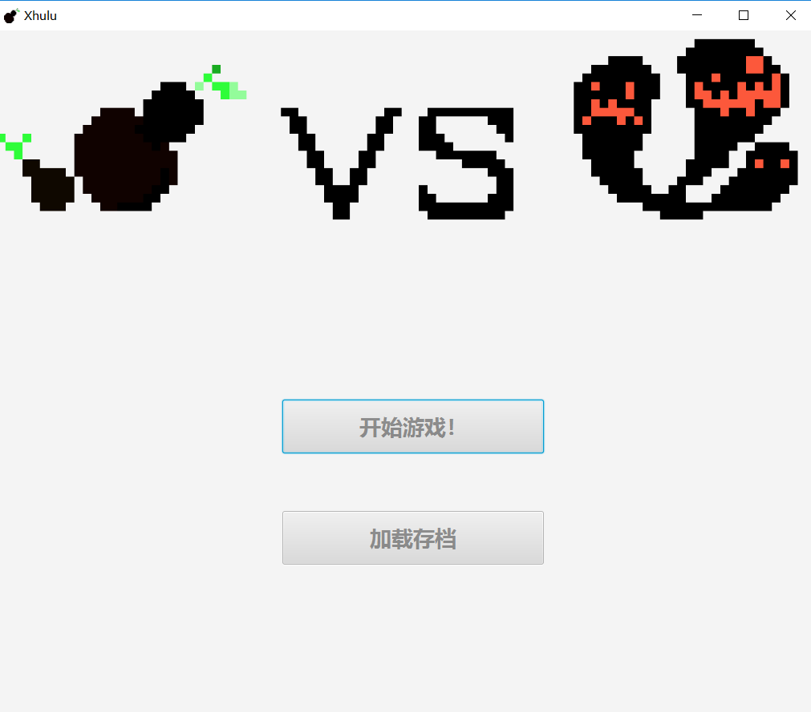

### 游戏界面：

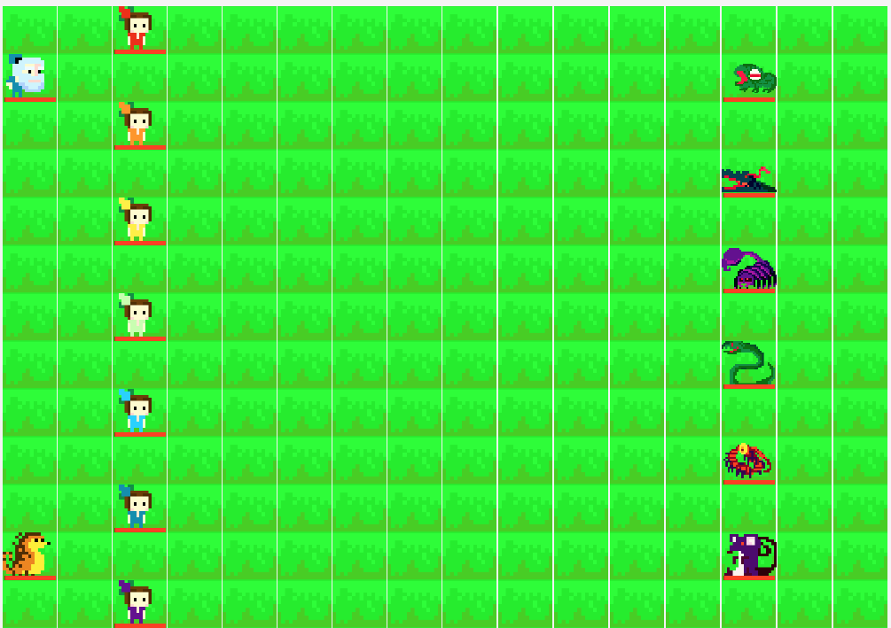

### 状态栏（当选中单位后出现在游戏界面底部）：

状态栏显示当前单位头像，技能名字、描述、图像

实时显示血量条和冷却情况


## 游戏流程介绍

### 联机模式：

1.首先一台电脑先运行`ServerMain`中的`main`函数，开启服务器


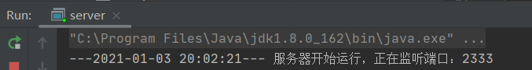

2.双方修改`client`类中的host和port与服务器匹配：

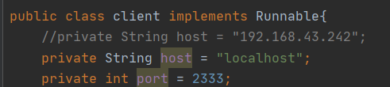

2.运行主体`main`函数，点击开始游戏，服务器会为客户端分配阵营，点击确定后开始游戏：

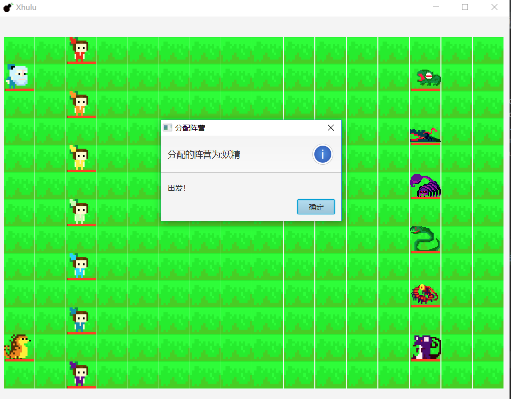鼠标点击确定操作单位

方向键控制移动

A键普通攻击

Q键使用技能

3.当一方单位全灭后游戏结束，回到初始界面。

### 单机模式：

直接启动主体main函数。

单机模式下可以操控所有阵营的单位。

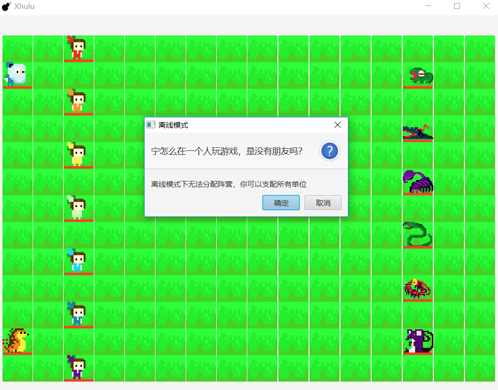

### 加载存档:

点击加载存档后，选择存档，进行播放。

在提供的文档中，有我们打的一个演示样例.txt。

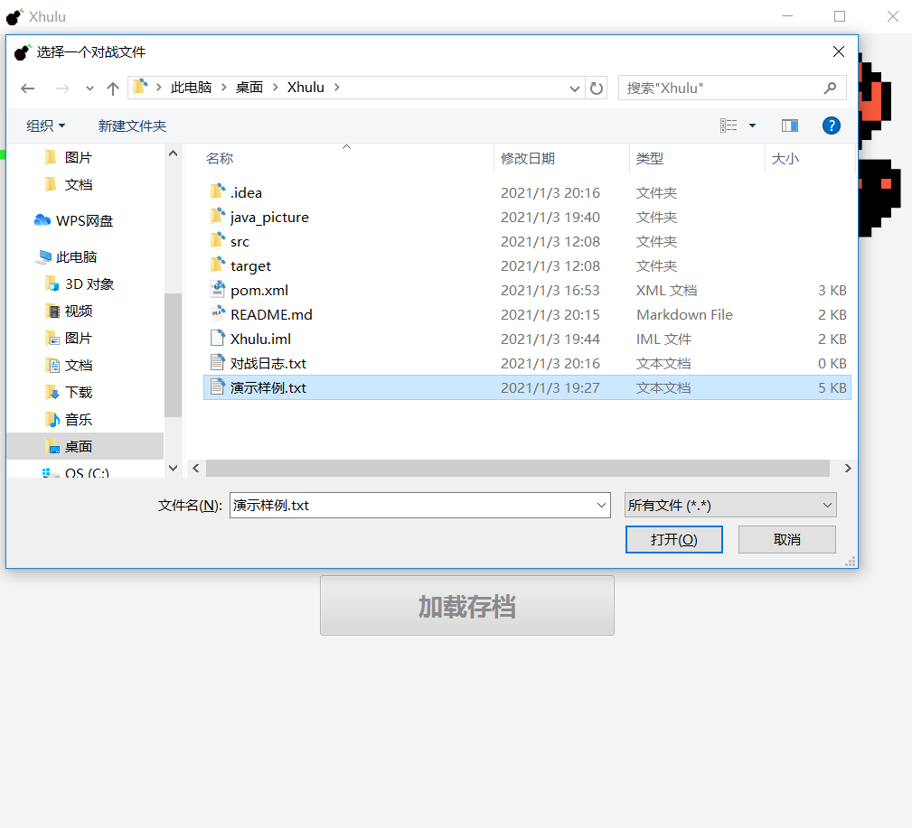

## 游戏设计思路

### package概览：

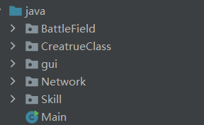

### `BattleField`包：

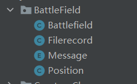

负责战场中所有单位的位置状态保存。

在Gui上战场使用的是`GridPane`，对应到`battlefield`中就是一个二维数组，`battlefield`是对`position`数组的一个**封装**，信息由`battlefield`传输给`position`，同时通过`battlefield`提供的接口对`position`进行修改。

数组的每个位置都是`Position`类，负责加载该位置上的单位，场地特效，场地背景

同时在`battlefield`的`putin`函数中实现了**重载**

`Message`是个枚举类，规定了每个单位的动作，分别为上下左右，普攻和技能

`Filerecord`负责解析转换对战文件中的内容到Battlefield可以接受的信息。

### `CreatrueClass`包：


负责不同单位的生成和设置。

`Creatrue`是这个包中所有类的基类，

提供了多个接口：设置单位图像、阵营、血量、攻击力、防御力、角色移动、攻击、使用技能等

剩下的类都是`Creatrue`类的子类，**继承**`Creatrue`类

在类中设置单位的属性，

并对`Creatrue`中的攻击，释放技能，移动进行**重写**（override）

### `gui`包：


只有一个`Controller`类

负责游戏与Gui的链接以及整体的逻辑，

通过`Controller`类实现点击按钮开始游戏，判断游戏结束，刷新画面，接收信息，加载存档等流程。

具体流程便是在检测到点击开始游戏按钮后，开始监听键盘和鼠标操作，并通过`solvemsg`函数将相关操作传入battlefield进行处理，同时Gui显示根据`battlefield`改变而改变。

通过`refreshtimer`实现每100 ms刷新一次

### `Network`包：

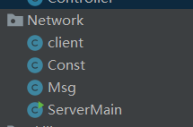

负责网络对战的实现

`client`是客户端，负责传输信息，保存日志

`ServerMain`是服务器端，负责传输信息，分配阵营

`Msg`和`Const`是两个辅助类，负责异常的设定和传输信息的打包。

### `Skill`包：

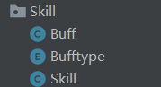

负责技能的设置。

Buff类用于设置技能的特效，例如减攻击，减防御，回血，眩晕（通过`Bufftype`设定）等

skill类用于设置技能的具体内容，名字，威力，技能描述，Cd，技能特效等。

并提供一系列接口用于获取类中变量，获得Cd情况等。


### 消息处理流程：

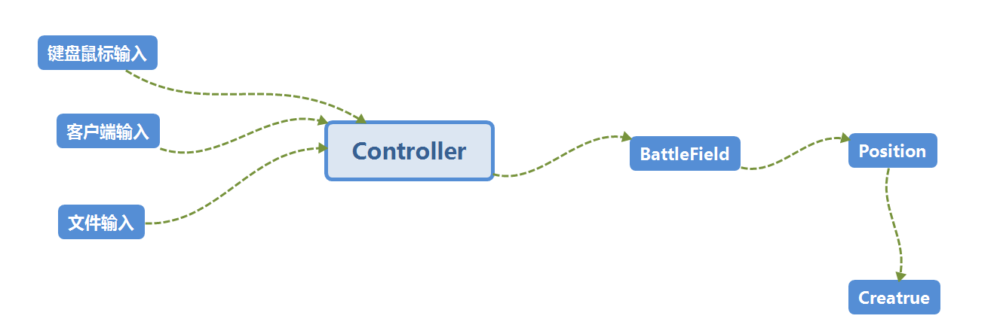

收到操作指令（键盘鼠标、客户端传来的信息，文件输入的信息），`Controlle`r会将具体的操作信息通知（`solvemsg`函数）`BattleField`，再由`battlefield`改变对应`position`中的`creatrue`的数值，最后由刷新函数再更新到Gui界面上。在联网状态下会同时将操作信息传给服务器。

## 游戏技能异常说明

眩晕：无法行动、攻击、使用技能

束缚：无法行动

混乱：所有移动操作方向相反

## 游戏技能CD实现

通过计时器timer进行设定，经过一定时间后对标记进行还原

```java
public boolean iscd()
    {
        if (flag) return true;
        flag=true;
        Timer timer= new Timer();
        timer.schedule(
                new TimerTask() {
                    @Override
                    public void run()
                    {
                        flag=false;
                    }
                }, cd*1000
        );
        return false;
    }
```


## 游戏单位技能说明

### 葫芦娃阵营

大娃：力大无穷

​			大娃身体变得巨大

​			攻击力提升，血量上限提升并回复所有血量

​			持续5 s  Cd: 15 s

二娃：千里顺风

​			二娃运用千里眼顺风耳

​		    使周围友方的攻击力上升50

​			持续15 s Cd: 30 s

三娃：铜墙铁壁

​			三娃硬了

​			防御力上升！

​			持续5 s Cd: 10 s

四娃：刚阳之火

​			四娃吐火

​			造成大量伤害 

​			Cd: 20 s

五娃：惊涛骇浪

​			五娃吐水

​			造成伤害的同时治疗自身 

​			Cd: 20 s

六娃：来去无踪

​			六娃进入隐身状态

​			不会受到攻击

​			持续1 s Cd : 5 s

七娃：紫金神葫

​			七娃使用神葫芦

​			对周围敌方单位造成伤害并束缚

​			持续5 s Cd: 30 s

爷爷：爷♥爷♥的♥爱

​			使所有友方单位回复所有血量 

​			Cd: 60 s

穿山甲：撼山动地

​				穿山甲摇动地面

​				对周围的敌人造成伤害,并造成3 s的眩晕 

​				Cd: 15 s

### 妖精阵营

蛇精：混乱撕咬

​			蛇精使用毒液撕咬前方单位

​			使敌方进入混乱状态10s，并造成伤害 

​			Cd: 15 s

蝎子精：幽冥禁锢

​				禁锢周围敌人

​				造成大量伤害，并回复一定血量 

​				Cd : 30 s

蜈蚣精：毒刺牢笼

​				蜈蚣精向周围刺出毒刺

​				造成伤害 并使敌方眩晕2 s 

​				Cd : 20 s

老鼠精：虚弱瘟疫

​				老鼠精释放瘟疫

​				使周围敌方单位虚弱，攻击力下降

​				持续 6 s，Cd : 10 s

鳄鱼精：血鳄咆哮

​				鳄鱼精发出咆哮

​				周围的敌人防御力大幅下降 

​				持续5 s Cd : 10 s

蛤蟆精：蛤蟆重击

​				蛤蟆精用舌头重击敌人

​				眩晕敌人1 s同时造成伤害 

​				Cd: 10 s

## 游戏线程说明

`refreshtimer`：负责每隔100 ms进行Gui的刷新

```java
refreshtimer=new Timer();
        refreshtimer.schedule(
                new TimerTask()
                {
                    @Override
                    public void run()
                    {
                        Platform.runLater(
                                () -> {refresh();} //刷新
                        );
                    }
                },0,100
        );
```


`msgtimer`：负责每隔100 ms读取客户端传来的输入

```java
msgtimer=new Timer();
        msgtimer.schedule(
                new TimerTask()
                {
                    @Override
                    public void run()
                    {
                        if (mc.ifNewMsg())//读取输入
                        {
                            
                            Platform.runLater(
                                    () -> {SolveReceivedMsg(mc.getMsg());}
                            );
                            if (battlefield.getState()=="Evil" || 		                                                 battlefield.getState()=="Justice")
                            {
                                if (battlefield.getState()==mc.getSide()) gamewin();
                                else gamelose();
                            }
                        }
                    }
                },0,100
        );

```


`filetimer`：负责每隔100 ms处理文件输入：

​				  （文件输入格式为时间+具体操作）

```java
 filetimer=new Timer();
        filetimer.schedule(
                new TimerTask()
                {
                    @Override
                    public void run()
                    {
                        Platform.runLater(
                                () ->
                                {
                                       while (fileindex<filelength &&      
                                              filetime>=filerecord[fileindex].getTime())
                                       {
                                            battlefield.solvemsg
                                            (
                                                filerecord[fileindex].getMsg(),                                     					  filerecord[fileindex].getX(),
                                                filerecord[fileindex].getY(),false
                                            );
                                           fileindex++;
                                       }
                                       filetime+=1;
                                       if (fileindex>=filelength)
                                       {
                                           recordend();
                                           this.cancel();
                                       }
                                }
                        );
                    }
                },0,100
        );
```


## 网络通信说明

对于游戏的网络通信架构，我们选择了client-server架构。

对战网络由一个服务器、两个客户端组成。

### 服务器端

首先，在两个客户端都接入服务器后，服务器为其分配阵营。并在线程池中开启对应的server来维持通信。链接端口需事先统一，且两台设备需在同一个局域网内方可连接成功。每当有一个新的客户端接入时，服务器将提示并输出其`Ipv4`地址。

```java
public ServerMain() {
        ExecutorService myES;
        int port = 2333;
        ServerSocket server;
        Socket client;
        try {
            server = new ServerSocket(port);
            myES = Executors.newCachedThreadPool();
            refreshLog("服务器开始运行，正在监听端口：" + port);
            int p=0;
            while(true) {
                client = server.accept();
                System.out.println("有新客户端连入服务器:"+client.getInetAddress());
                socketList.add(client);
                myES.execute(new Service(client,p));
                p++;
                p = p%2;
                if(socketList.size() >= 2) 
                    start_game(socketList.get(0),socketList.get(1));
            }
        } catch (Exception e) {
            refreshLog("服务器启动失败");
            e.printStackTrace();
        }
    }
```


其次，服务器会对每个加入的客户端开启“Server”类。Server类实现了Runnable接口，用于实现多线程。

最后，服务器与客户端之间在链接后采用了发送心跳包的方式来保持链接，双方会自动屏蔽心跳包，仅仅对有效信息进行相应处理。当出现读取信息异常时，认为客户端已推出游戏平台，并在线程池和客户端队列中删除相应的数据。

```java
class Service implements Runnable {// 实现Runnable接口，用于实现多线程功能
        private Socket socket;// Service类私有socket对象，用于服务器存储用户的socket// 输入流
        private boolean ifNewMsg = false;
        private int id_op;
        private int id;
        private BufferedReader in;// 输入流

        public int getId() {
            return id;
        }

        Service(Socket socket, int _id_op) throws IOException {// 构造方法
            this.socket = socket;
            id = _id_op;
            if (id == 0) _id_op = 1;
            else _id_op = 0;

        }

        @Override
        public void run() {// 线程运行方法
            try {
                // 等号左边是本类Service类私有对象，等号右边是ServerMain类的构造方法ServerMain()传来的参数
                // 输入流
                in = new BufferedReader
                (new InputStreamReader(this.socket.getInputStream()));
                // IP地址
                userIP[id] = this.socket.getInetAddress();
                // 用户名
                userID[id] = String.valueOf(in.readLine());// 用户第一次的输入流是用户名
                // 服务器准备发出消息，新用户连接
                serverMsgToSend = 
                    userID[id] + "加入对战平台，当前" + socketList.size() + "人在线";
                System.out.println("serverMsgToSend");

```


### 客户端

客户端为游戏主体提供了`sendMsg`、`getMsg`、`ifNewMsg`、`isConnect`、`getSide`这5个外界端口，它们满足了对游戏运行的需要。

```java
	public String getSide()
    {
        if (flag) return "Justice";
        return "Evil";
    }

    public void sendMsg(String str){
        MsgReceived.addLast(str);
    }
    public String getMsg() {
        String res = MsgToSend.getFirst();
        MsgToSend.removeFirst();
        return res;
    }
    public boolean ifNewMsg(){
        if(MsgToSend.size()!=0)return true;
        else return false;
    }
    public boolean isConnect() {
        return connect;
    }
```


同时，客户端还需要完成记录对战日志以及完成对游戏主体、服务器信息的收发。对战日志使用文件输入输出流进行文件的改写，通过时间戳计算每一步以开始游戏为原点的时间记录，方便读取存档时对游戏的复盘。

关于信息的转发，在确认连接到服务器并得知阵营后。为了避免因输入过快而导致的漏包现象，客户端采用了消息队列的方式分别对需要发送给服务器和游戏主体的消息进行了缓冲，这样及时有延迟也不会使两边的对战不同步。同时客户端对发送“endgame”信息的一方发送”lose“判负，并在向服务器发送消息“win"后结束运行。

#### 向服务器发送游戏主体信息：

```java
 while (ifgaming) {
                try {
                    if(MsgReceived.size()!=0){
                        String tmp = (String) MsgReceived.getFirst();
                        MsgReceived.removeFirst();
                        bw.write( tmp + "\n");
                        bw.flush();
                        if(tmp.equals("endgame")){
                            MsgToSend.addLast("lose");
                            endGame();
                        }
                        else {
                            refreshLog(tmp);
                        }
                    }
                    else{
                        bw.write("nothing\n");
                        bw.flush();
                    }
```

（“nothing”即为心跳包，仅用来维持与客户端的连通）

#### 将待游戏处理的信息存入队列中：

```java
if(ifgaming) {
                        String tmp = br.readLine();
                        if (tmp.equals("nothing")) {
                        } else {
                            if (tmp.equals("endgame")) {
                                MsgToSend.addLast("win");
                                endGame();
                                break;
                            } else {
                                MsgToSend.addLast(tmp);
                                refreshLog(tmp);
                            }

                            System.out.println(MsgToSend);
                        }
                    }
```

（存入队列中的仅为有效信息，心跳包”nothing“在客户端被屏蔽）

## 文件加载说明

使用`javafx`中的`FileChooser`进行文件选择 并使用IO进行文件读取

```
FileChooser chooser = new FileChooser();
        chooser.setTitle("选择一个对战文件");
        chooser.setInitialDirectory(new File("C:\\"));
        chooser.getExtensionFilters().addAll(
                new FileChooser.ExtensionFilter("所有文件", "*.*"),
                new FileChooser.ExtensionFilter("所有文本文件", "*.txt", "*.doc", "*.docx"));

        File file = chooser.showOpenDialog(stage); // 显示文件打开对话框
        System.out.println("准备打开的文件路径是："+file.getAbsolutePath());
```

文件中的记录为 时间+坐标+动作信息

这里使用`filetimer`对文件进行处理，播放时每100 ms进行一次处理，把文件时间小于当前时间的未完成的文件指令通过`solvemsg`传给`battlefield`进行处理。

## 游戏动画效果

对每个角色制定了移动动作，攻击动作，技能特效

每个角色都有不同方向的站立和攻击图像，

同时有的角色会有独特的技能状态下的图标以及技能特效。

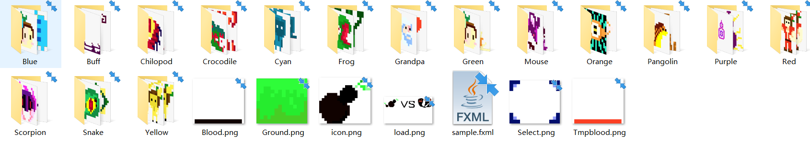

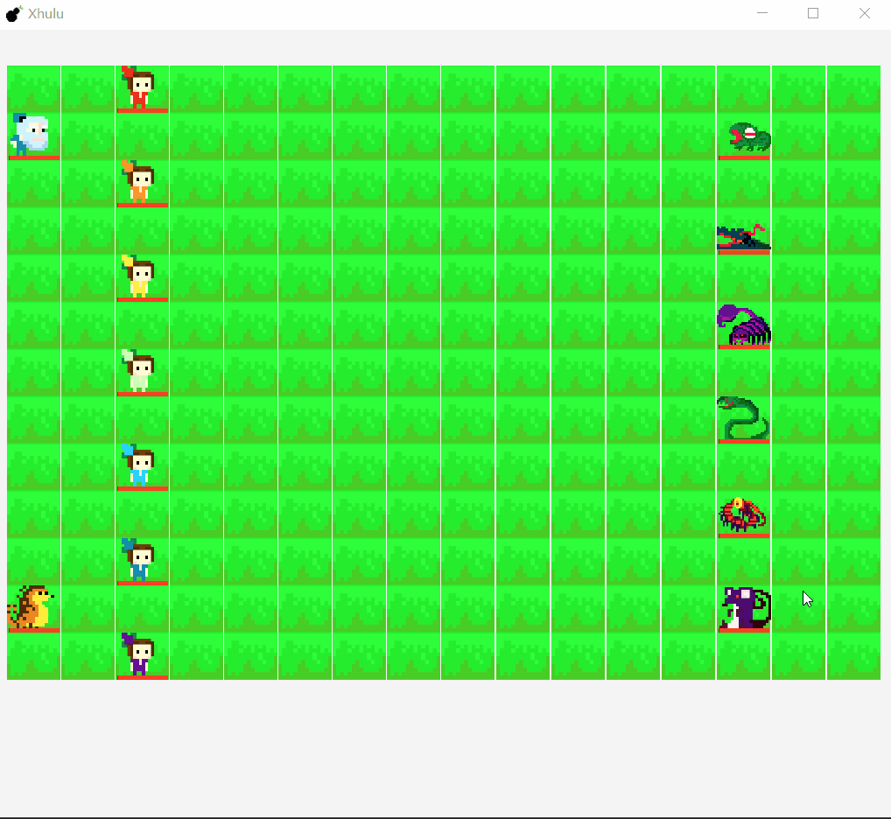


## 游戏分工组队情况

该游戏是由**181860025 贡辰** 和**181860101 王逸**组队完成

### 分工情况

181860025 贡辰：

独立完成了`BattleField`、`gui`、`Skill`包的编写、图片的绘制。


181860101 王逸：

独立完成了`Network`包的编写。


合作完成了`CreatrueClass`包的编写：

贡辰完成了葫芦娃阵营的编写；

王逸完成了妖精阵营的编写。


## 项目感悟

这次项目给我最大的感受之一就是在写项目之前真的先把具体框架结构想想清楚，哪边该继承，哪边该组合聚合、各个类之间的信息传递该如何实现。在写项目的时候进行过一次对框架的大改动，就是一开始没有想好框架结构,从而浪费了很多时间。

还有一个大的感受就是体验到了合作完成项目和自己完成项目的不同之处，之前感觉合并双方的代码并不需要很久，但这次项目在合并代码，调bug方面花了许多时间。也体会到了interface接口在分工设计程序上的重要性。

这次项目让我了解到了`Javafx`，线程，网络等多方面的知识，拓展了我的代码能力。

