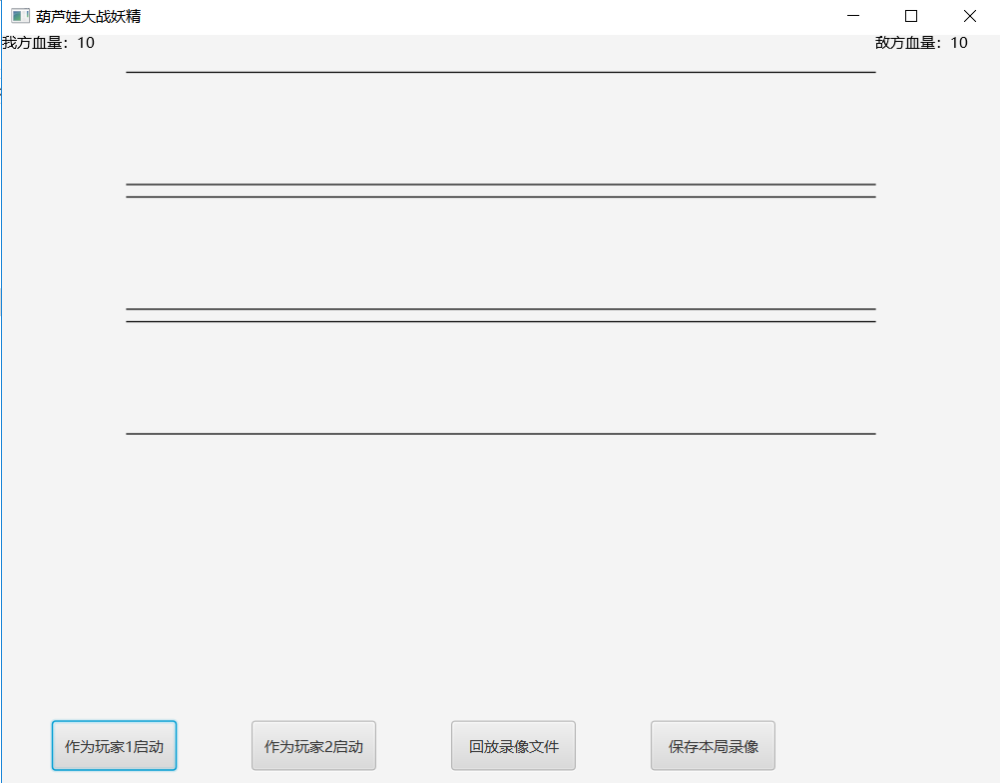
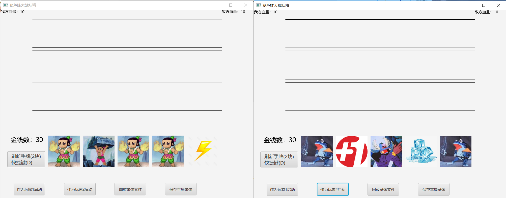
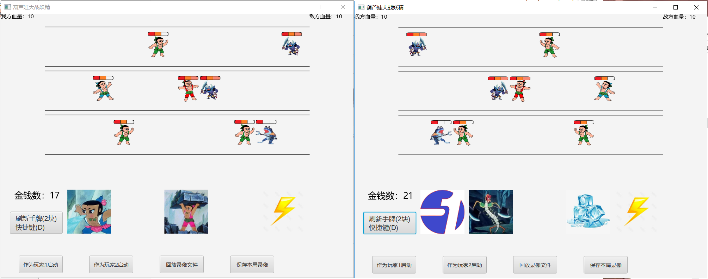
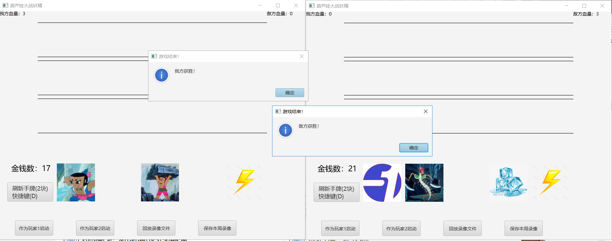
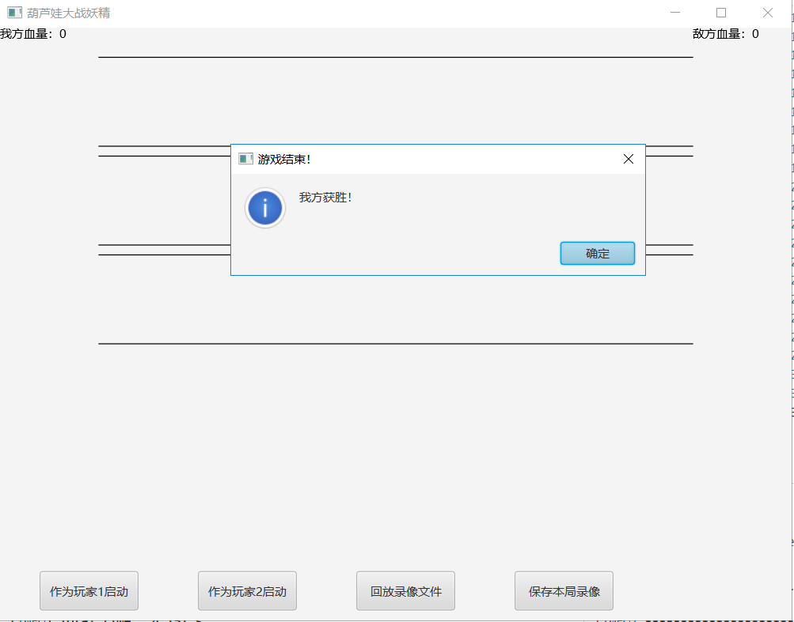

# 葫芦娃大战妖精双人游戏

## 游戏简介

本游戏的玩法参考了鹿顶计，是一款即时类放置策略双人小游戏

核心玩法：

1. 对战双方各自代表**葫芦娃阵营（玩家1）**和**妖精阵营（玩家2）**。
2. 游戏有跑道区，手牌区。手牌分2种：人物卡和道具卡
3. 跑道区有3条跑道，玩家从手牌区**抽人物卡拖到跑道上**，人物自动向对面阵营走去，在路上人物会**对拼力量**，顶来顶去。
4. 玩家从手牌区抽**道具卡，点击或拖放到跑道上**，产生对应效果
5. 人物走到一条线尽头会给对方指挥官扣血，血量，分出胜负

人物卡

葫芦娃阵营

1. 穿山甲，力量1，花费1

2. 大娃，力量3，花费3

3. 火娃，力量2，花费2

4. 水娃，力量2，花费2


妖精阵营

1. 青蛙精，力量1，花费1
2. 蜈蚣精，力量2，花费2
3. 蛇精，力量2，花费2
4. 蝎子精，力量3，花费3


道具卡

1. 加一：使对方现有卡牌区的花费+1
2. 减一：使自己现有卡牌区的花费-1
3. 滚石：消灭一条线上的敌我单位
4. 冰冻：冰冻一条线上的敌方单位，持续3s
6. 闪电：消灭一条线上的第一个敌方单位


## 游戏截图和操作说明

主界面如下




玩家1先启动，玩葫芦娃阵营

玩家2后启动，玩妖精阵营




玩家2启动后即游戏开始，双方可拖动人物卡/道具卡到跑道释放技能，或点击道具卡生效道具，或者刷新手牌，两边游戏镜像同步




人物头顶的格子代表力量值，跑到道路尽头后，能对对方总血量造成等额伤害，血量归零后游戏结束




游戏进行了后台录像，可在游戏结束后点击保存本局录像进行保存


游戏可以进行回放，在游戏开始前点击回放录像文件，选择录像进行回放





## 模块设计

游戏大体分为三个模块

* 逻辑模块：负责处理游戏核心的抽卡、人物碰撞、互顶等机制
* 显示模块：负责画面绘制更新、功能按钮等管理
* 通信模块：负责交互网络信息，发送和解析包


## 类的具体设计和难点实现

### 游戏入口类 Main

游戏入口，创建stage，启动游戏逻辑，设置关闭窗口事件

### 游戏主类 MainCanvas

管理整体游戏运行、游戏资源、提供与javafx组件交互的接口


刚实现时最容易犯的错误就是，javafx场景、组件等等位于一个线程，从其他线程尝试对javafx元素进行写操作（如给场景中添加人物、卡牌等）时，不能直接操作javafx线程中的元素，而是需要使用这样的写法：

```java
Platform.runLater(new Runnable() {
    @Override
    public void run() {
        //do write operation to javafx elements
    }
});
```

将操作委托给Platform，让它选择合适的时机执行，否则程序就会卡住


### 人物抽象类 Creature

含力量值，位置，移速，外观，所属阵营等

提供移动，碰撞检测等方法


**碰撞是本游戏的核心和灵魂所在，如果有物理引擎可以用的话，那就可以化简为处理一些自己会动的2D刚体和施力问题**

但本游戏有自己的速度要求，而且还有额外的冰冻效果的存在，我们手动实现如下：


举个例子，假如跑道上的生物有6只，我方依次为M2,M1,M0，对方依次为Y0,Y1,Y2，布局如下：

> M2 M1 M0 Y0 Y1 Y2 

首先，只有队头的生物（们）会直接被对方力量怼，简单分为两种情况：


1. M0和Y0未接触：相安无事，大家各自往前走
2. M0和Y0接触：
   * 从M0开始检测M0身后与M0贴着的队伍有哪些人，设这些人为Ms
   * 从Y0开始检测Y0贴着的有哪些人，设为Ys
   * 对比Ms力量之和Mpower，Ys力量之和Ypower
   * 如果Mpower > Ypower，Ms中的人速度变为1，Ys中的人速度变为-1；如果相等，大家都变0

有一个小问题，生物接触怎么判断？只要算两个生物的中心距离与体型的和，比较一下即可。


但简单的这么写**会产生一个BUG：当两方生物比是N:1的时候，力量弱的一方被顶回来的时候，速度会慢下来，甚至一顿一顿的。**

这个BUG藏的很深，由于每个生物各自位于自己的线程里运行碰撞检测，当弱的那方被顶回来的时候，强的一方会出现**贴合不紧密的问题（主要是强1和强2345等脱节了）**，导致一会**1:1**，一会**N:1**，所以弱的一方不断在被顶和势均力敌之间变换，导致出现问题。

解决的话：

1. 从强队自身问题入手，可以让强的一方在第一次顶对面时，后面的兄弟稍微多走一点，贴的紧密一些，防止抖动的问题产生
2. 简单的办法是如果队头和对面队头碰了，发现对面队头速度为负，那就直接跳过下面的顶人逻辑，状态更新留给对面补人后再更新

两者相结合，完美修复了这个BUG


以上是不带冰冻效果的碰撞逻辑，带了冰冻后稍微复杂一些，冰冻的设定是这样的：

1. 假如你在运动过程中撞到了冰冻的物体，那么你也不能运动，需要原地等待直到他解冻（并且被你碰到的物体也需要等待，这具有传递性）
2. 冰冻可以重复施加给物体，效果是延长冰冻的时间

基于以上两点，需要增加冰冻标志和冰冻解冻函数，且解冻需要延迟触发，实现思路如下

1. 被冰冻时，设置冰冻标志，重新设置冰冻开始的时间，设置冰冻时长
2. 启动一个TimerTask，TimerTask的内容是：计算冰冻开始到现在的时间差，如果小于冰冻时长，那么不解冻（为什么会小于冰冻时长？因为比如我第0秒冰冻3s，第1秒再次冰冻3s，在第3秒时，第一个解冻的TimerTask到来，但这时候不该解冻，而应该等到第4秒，第二个解冻的TimerTask到来才解冻）；如果大于等于冰冻时长，那么解冻
3. 在生物的运动函数中加上有关冰冻的判断
   * 如果自身冰冻了，那么不运动
   * 如果碰到一个被冰冻了，或速度为0（被冰冻物体挡住走不了）的物体，自身速度设为0
   * 如果没碰到上述情况，执行之前正常的碰撞逻辑


由Creture类派生出的具体的葫芦娃们和妖精们的类型，位于各自的类中，未来可以重写自己的攻击或移动方法，实现多元化


### 卡牌抽象类 Card

含价格，图片等

根据功能分为

1. 可点击类型的抽象卡牌 ClickableCard
2. 可拖动类型的抽象卡牌 DraggableCard


具体表现为，鼠标点击卡牌

* 如果是可以释放在跑道上的的卡，那么卡牌跟住鼠标的拖动
  * 下一次点击的位置如果在跑道上，就放在那个跑道上，生成人物开始跑/卡生效
  * 否则，放回原位
* 如果是直接生效卡（+1，-1）那就直接生效


至于实现，就是给卡牌的imageView设置setOnMousePressed、setOnMouseReleased、setOnMouseExit三个方法，保持拖动时跟随，最难实现的拖动核心代码如下

```java
protected void setOnMouseDragged() {
    imageView.setOnMouseDragged(e -> {
        double dx = lastEventX - e.getSceneX(); //上次事件偏移和本次事件偏移
        double dy = lastEventY - e.getSceneY();
        double nx = lastX - dx; //上次图片偏移和本次图片偏移
        double ny = lastY - dy;
        imageView.setTranslateX(nx); //设置图片偏移量
        imageView.setTranslateY(ny); 
    });
}
```

实现效果类似云顶之奕的抽卡

具体人物卡和道具卡再根据功能，继承ClickableCard或者是DraggableCard

然后重写自己的cardAction


这里体现了封装继承的思想，大大减少了代码量，提高了复用性

### 跑道类 Runway

含多个人物；负责管理我方和敌方的人物列表，包括增删改查和与卡牌联动

### 卡牌区类 CardField

含有现有卡牌列表，现有金钱数；提供购买卡牌、刷新卡牌方法

在移除卡牌、刷新卡牌时需要处理线程安全问题，因为卡牌列表属于共享资源，需要加读写锁

### 跑道区类 RunwayField

含上中下三条跑道；提供控制跑道位置，绘制跑道形状方法

### 指挥官类 Hero

有初始血量10点，扣完即游戏结束，未来想做像云顶小小英雄那样的指挥官模型和血量

### 服务器类&客户端类 GameServer & GameClient

模型是一个点对点的通信模型，玩家1被动等待，玩家2主动连接

在玩家1开始游戏后，于本地28080端口开启监听，会单独起一条线程来负责收发包和解析包，执行命令

在玩家2开始游戏后，连接玩家1的服务器，会单独起一条线程来来负责收发包和解析包，执行命令


### 回放类 Recorder

考虑到可读性，未采用序列化，以纯文本记载，记录的格式为

> 时间（毫秒） 操作人（i/enemy） 操作类型（添加人/用卡） 操作参数（跑道编号或其他参数） 


每次我方抽卡操作、接收到对面玩家的数据包时会记录时间和操作，然后在游戏结束时可以按按钮，通过fileChooser选择保存文件

回放时采用TimerTask机制，根据每行记录的时间和操作设置不同的TimerTask并延时执行


## 测试

由于测试依赖javafx运行stage，我测试了人物运行的碰撞检测函数，通过设置不同位置的物体进行测试，唯一不好的是需要手动关闭开启的javafx测试窗口


## 打包运行

执行mvn package即可直接打包

双击target/huluwa-1.0.0.jar即可运行


## 开发杂记

### 12.24

把人物拼力量的补上
设当前速度和初始速度
新拖上去的葫芦娃是初始速度
如果贴在一起的葫芦娃力量不足，所有贴在一起的葫芦娃速度取小负数
力量相等，速度取0
如果力量够了，速度取正
贴在一起的葫芦娃时刻互相比较

具体：
假设所有生物初始移速一样，都是1
M2 M1 M0 Y0 Y1 Y2
只有队头的生物（们）会被对方力量怼


1. M0和Y0未接触
相安无事，大家各自往前走

2. M0和Y0接触
从M0开始检测M0身后与M0贴着的队伍有哪些人，设这些人为Ms

从Y0开始检测Y0贴着的有哪些人，设为Ys

对比Ms力量之和Mpower，Ys力量之和Ypower

如果Mpower > Ypower，Ms中的人速度变为1，Ys中的人速度变为-1
如果相等，大家都变0

* 接触怎么判断：算(x,y) 和figuresize，
  abs(x1-x2) <= s1+s2就算接触

BUG：N:1的时候，力量弱的一方被顶回来时候速度会慢，不知道为啥

我估计是这样，顶回来的时候，强的一方贴合不紧密，导致一会1:1，一会N:1，所以弱的一方不断在0和-1之间跳，导致出问题
解决的话就是让强的贴合近一点？no，很难实现，简单的办法是如果队头和对面队头碰了，发现对面队头速度为负，那就直接跳过

***

D牌时崩溃，要加线程锁，而且反向遍历删除，由于增删卡牌只有在主线程使用，所以arraylist没事，但考虑选卡时候的效率，要不改成linkedlist？

***
### 12.25
跑道上的人物缩小一点

下一步实现多元的卡牌，完善金币自动增长和价格，D牌时刷新5张随机卡，实现道具卡

道具卡，需要提供一个Prop接口

道具卡

1. 重置：重置手牌，没用，改D牌了

2. 加一：使对方现有卡牌区的花费+1，这得发个包，给cardField添加cardsCostPlusN方法

3. 减一：使自己现有卡牌区的花费-1，给cardField添加cardsCostMinusN方法

4. 滚石：消灭一条线上的敌我单位，得发包，给runway添加removeAllCreature方法

5. 冰冻：冰冻一条线上的敌方单位，3s，得发包，给runway添加frozenEnemyCreature方法，给creature添加frozen方法，设置冰冻计时器启动，在update中，如果处于冰冻状态，速度归0，计时器减少，计时器结束时速度恢复（到原来状态）（恢复到默认速度可能会有问题？）

6. 闪电：消灭一条线上的第一个敌方单位，得发包，给runway添加removeEnemyHead方法，和对应removeMyHead线程安全问题

BUG： D牌的时候会卡一下，估计D的也得作为单独线程，放入cardField，其实并不是，是因为D牌算法写的太慢了，考虑换LinkedList试试
是fillcards太慢，是createRandomCard太慢

冰冻：立刻设置isRunning=false，计时器负责若干秒后解冻，设置isRunning=true

设置辅助标志willThaw

正常流程，冰冻时设置isRunning=false，检查willThaw，如果为true，就设为false，如果为false，就设置willThaw=true。然后schedule一个，3s后启动的线程
内容为，如果willThaw=true，isRunning=true
否则设置willThaw为true

被冰时更新当前时间，冰冻时间，到点了检查时间差是否>=冰冻时间，到了就解冻，完事~

TODO 还要给update加上后面的撞到前面的，速度减到和他一样，还得恢复

撞到冻住的人，就不要move了，但速度和isrunning不改变

***

### 12.26

再下一步实现多元的人物，多实现几个人物，和图片

人物添加力量格子，价格文本

金钱增长速度减慢

D牌需要的钱增加

### 12.27

办比赛

### 12.28-12.30 am

开题报告

### 12.30 pm
优化葫芦娃放置，如果跑道口子上挤着葫芦娃，会放不上去

### 1.1

元旦放假

### 1.2

敌方人物生成时，图片反转，imageView.setScaleX(-1)

人物移动时有动画而不是单独图片
人物被闪电击杀时有特效
人物被冰冻时有特效
人物被清理时有特效
游戏音效

游戏开始界面，选边
* 开始界面，有开始游戏、录像回放、设置
    * 开始游戏会让你选择自己的身份是服务器还是客户端，服务器的话会提示你的ip，要求设置运行端口（默认28080），然后按开始就进入accept()等待，如果是客户端的话就要求设置服务器的ip和port（默认28080），按开始就尝试连接服务器。
    
    * 客户端在点开始连服务器成功时会发送一个开始游戏的包，然后等
    * 服务器在客户端连上后会返回一个开始游戏的包，然后开始游戏
    * 客户端收到包后也开始游戏
    

### 1.3

包格式String
addEnemyCreature 0
clearRunway 0
freezeRunway 0
killMyHead 0
costAddN 1

添加多种人物，区分不同阵营的D牌，在人物上方显示人物力量值1-3格
现在是

大娃 力量3 价格3
火娃 力量2 价格2
水娃 力量2 价格2
穿山甲 力量1 价格1
爷爷（考虑去掉）


蝎子精 力量3 价格3
蛇精 力量2 价格2
蜈蚣精 力量2 价格2
青蛙精 力量1 价格1

### 1.4

力量条
设置三种格子，draw的时候选择显示哪个图片就行

跑道美化，上中下三条道各自整个图片垫着

背景美化，添加个背景

加录制和回放
新增Recorder类，提供两个按钮，一个是保存本局比赛录像，一个是回放（选文件）

保存本局录像：游戏开始时记录系统时间，每个卡牌生效操作和~~D牌操作(随机)~~都记录事件类型和系统时间，格式

时间 操作人 操作内容 参数
0.0 i freshCard null
1.1 i AddDawa 0
1.2 enemy AddXiezijing 2
5.5 i killEnemyHead 2
5.7 enemy killMyHead 1

按下按钮后可以保存录像到yyyy-mm-dd-time.txt

回放时，按下按钮选择文件
一行行解析文件，处理命令