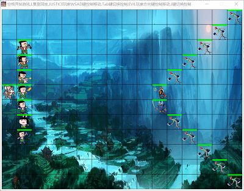
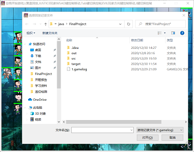
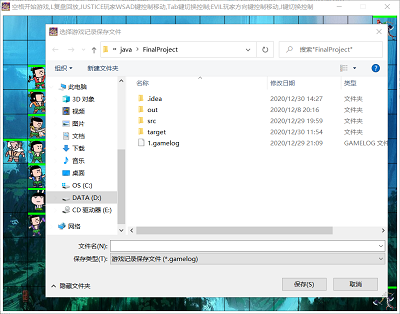
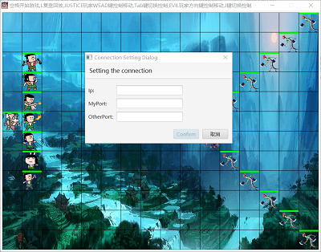
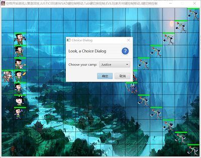

# Java期末大作业  
171860631 王赠龙  
邮箱：171860631@smail.nju.edu.cn
## 一、游戏运行方式
&emsp;&emsp;本次大作业要求实现双人联机战斗以及通过鼠标和键盘操控战斗，并且还要求实现记录战斗过程且可回放，我的实现如下：  
&emsp;&emsp;首先启动程序(运行Main类中的main方法，或执行java -jar target/FinalProject-1.0-SNAPSHOT.jar命令)进入游戏等待界面如下：

<div align=center>

  

</div>  

1. 游戏回放  
   &emsp;&emsp;若要查看游戏回放，则按下L键后会弹出选择游戏记录文件的对话框如下：
   <div align=center>

     

   </div>  
   &emsp;&emsp;玩家可以选择游戏记录文件(.gamelog文件)进行回放；若玩家未选择游戏记录文件直接关闭文件对话框，则返回游戏等待界面等待玩家重新操作。游戏回放功能的演示视频见ReviewExample.mp4(演示视频中只展示了进行游戏回放时的操作，并未完整的展示回访记录)。
2. 联机对战
   &emsp;&emsp;若要进行联机对战，则玩家需要在游戏等待界面按下空格键，此时会弹出文件对话框要求玩家选择本次对战要保存为的游戏记录文件，保存界面如下：
   <div align=center>

     

   </div>
   &emsp;&emsp;若玩家未选择要保存的游戏记录文件，则游戏返回到等待界面等待玩家重新操作；若玩家选择了要保存的游戏记录文件，则弹出对话框要求玩家输入对战玩家的IP地址、对战玩家接收数据报的端口号和自己接收数据报的端口号，界面示例如下：
   <div align=center>

     

   </div>
   &emsp;&emsp;之后玩家还需要选择游戏中自己的阵营，分为Justice阵营(操控七个葫芦娃和爷爷)和Evil阵营(操控蛇精、蝎子精及蜈蚣小兵)，选择界面如下：
   <div align=center>

     

   </div>
   &emsp;&emsp;玩家完成以上步骤之后进入等待状态，直到与另一个玩家完成网络连接、确认阵营选择无冲突，则双方开始游戏。若双方选择了同一阵营，则输出阵营选择发生冲突的提示信息并且游戏结束。在单个电脑上模拟双玩家对战的演示视频见BattleExample.mp4(演示视频中在同一个电脑上运行两个相同的项目模拟玩家对战，演示了进行对战时的操作，并未完整展示对战过程)。
3. 游戏操作方式
   &emsp;&emsp;我对各个生物攻击方式的实现较为简单，即每个生物只会攻击与他距离为1的生物，但每个生物的攻击力、防御力、最大生命值的设定均不同，可以在配置文件中修改(BattleControl.BattleConfig.java)。联机的玩家各自操控一个阵营的生物：操纵Justice阵营的玩家可通过按Tab键切换控制的生物(默认情况下操控老爷爷)，并可以通过按W、S、A、D键控制该生物向上、下、左、右移动；操纵Evil阵营的玩家可通过按J键切换控制的生物(默认情况下操控蛇精)，并可以通过按方向键控制该生物的移动。另外，不受玩家控制的生物以每秒一次的频率随机移动。

## 二、代码框架
&emsp;&emsp;&emsp;&emsp;我的代码主要包括BattleControl、Creature、Record三个包，主类为Main。各自的功能说明如下：  
|包名|功能|
|:-:|:-|
|BattleControl|1. BattleConfig.java：定义图形界面的基本参数(场景的宽度, 二维表格的长和宽等);定义各个生物的攻击力、防御力、最大生命值.<br> 2. Player.java：定义枚举类型Player用于确定玩家的阵营.<br> 3. Controller.java：Controller类负责控制整个游戏的运行逻辑,包括生物的初始化、各个线程的启动、文件读写器的设置、游戏的开始及结束、网络通信信息的发送和接受等.<br> 4. GameMap.java：控制整个二维网格中生物位置的变化、显示战斗场景、写战斗记录文件.<br>5. GameState.java：控制整个战斗的状态，包括开始、暂停、结束、回放，若游戏结束还会记录游戏的胜者.<br> 6. NetPacket.java：定义网络通信时需要传递的信息，网络通信传送的实际就是NetPacket类的对象.<br>7. NetThread.java：定义监听网络通信端口的线程，根据监听线程获取的数据包来改变另一阵营的生物状态.|
|Creature|1. 定义了基类Creature以及派生类HuLuWa等，表示各种生物.<br> 2. 定义了Controllable接口，包含在控制下的移动等方法.<br>3. 定义了枚举类型Type，用于生物确定自己属于哪一阵营.<br>4. 定义了枚举类型Direction，用于代表生物移动的各个方向.|
|Record|1. RecordSample.java：定义了需要向战斗记录文件中写入的每一个生物的信息.<br> 2. FrameRecord.java：定义了每一帧需要向战斗记录文件中写入的信息，本质上是RecordSample对象的列表，向文件中写入的实际就是FrameRecord类的对象.|

## 三、面向对象思想
### 1. 继承
&emsp;&emsp;继承的思想最直接的体现在Creature包中各个生物的定义，所有生物都继承自基类Creature，Creature类中定义了所有生物都具有的属性，例如生命值、位置、姓名等；同时，Creature类中也定义了所有生物都具有的方法，例如随机移动方法，这很好的体现了代码复用的原则。另外，Creature类还实现了Runnable接口和Controllable接口，每一个生物都可以在一个单独的线程上执行来实现移动和攻击，同时每一个生物都可以被玩家控制移动，因此Creature中重写了Controllable接口中的方法(在玩家控制下移动等方法)，示例代码如下：
```
@Override
public void controlledMove(Direction dir){
   int biasX, biasY;
      switch(dir) {
         case UP:biasX=0;biasY=-1;break;
         case DOWN:biasX=0;biasY=1;break;
         case LEFT:biasX=-1;biasY=0;break;
         case RIGHT:biasX=1;biasY=0;break;
         default:biasX=0;biasY=0;
      }
   move(biasX,biasY);
   NetPacket netPacket=new NetPacket(true,name,posX,posY,hp);
   Controller.send(netPacket);
}
   
```
### 2. 封装
&emsp;&emsp;封装在整个工程中到处都有体现，例如每个生物都有各自的私有属性，这些属性是不可以暴露给外部直接访问的，因此对于每一个类的每一个属性，我都提供了get方法以及set方法来实现对生物属性的访问，这也增加了代码的可读性。<br>
&emsp;&emsp;在大作业中最能体现封装重要性的就是GameMap类中描述N*M维战场的数组creatureArray，生物的移动、战场的绘制都需要使用此数组，但这个数组是不可以直接被各个生物直接访问修改的，只能通过GameMap类提供的setCreature()、removeCreature()等方法来修改二维数组中的生物，这也使得GameMap类不必暴露其内部具体实现，降低了代码耦合度。

### 3. 聚合
&emsp;&emsp;聚类关系直接体现在Controller类与GameState类之间。GameState类用于表示整个游戏当前的状态，而Controller类需要根据当前游戏的状态进行各项操作，因此聚类最能反映二者之间的关系，即Controller类中包含GameState对象，继承、实现等关系均无法适用于我们的需求。
### 4. 多态
&emsp;&emsp;多态最直接的使用方式就是使用子类的对象初始化基类的引用。我对于多态的使用主要体现在游戏开始时对GameMap类中creatureArray数组进行初始化。由于各个生物是Controller类中的域，因此我将各个生物放入了Creature类的ArrayList中并在创建GameMap对象时使用此列表初始化creatureArray数组，在初始化数组的过程中会根据每个生物不同的位置、照片信息完成设置。如果选择在GameMap类中也定义表示各个生物的域来初始化，那么就会导致代码耦合度过高，且可读性差。

## 四、设计模式
&emsp;&emsp;大作业中我主要使用的设计模式包括装饰器模式和观察者模式，下面分别阐述：
### 1. 装饰器模式
&emsp;&emsp;装饰器模式主要用于读写游戏记录文件，使得输入输出流的功能得到了扩展，体现了合成复用的思想，这样的方法也更加灵活，实现了更加高效的读写文件。示例代码如下：
```
logWriter = new ObjectOutputStream(
                new BufferedOutputStream(
                    new FileOutputStream(gameLog.getPath())));
                  
logReader = new ObjectInputStream(new BufferedInputStream(
                                      new FileInputStream(file)));
```
### 2. 观察者模式
&emsp;&emsp;察者模式主要体现在监听游戏结束和监听网络通信端口。
#### 监听游戏结束
&emsp;&emsp;由于游戏开始后便进入多线程同时运行的模式，且游戏中建立了网络连接和文件的输入输出流，因此在游戏结束时需要将这些资源全部释放。那么如何判断游戏已经结束并且调用游戏结束的处理函数呢？在作业中我利用了GameState类，游戏判断结束的逻辑为一方生物全部阵亡，此时GameState对象中设置状态为已结束，那么如何使得结束信息被知晓呢？在作业中我利用了观察者模式，在游戏开始时创建一个新的线程来监听GameState对象的状态，并且利用wait()方法和notifyAll()实现监听线程在GameState对象上的阻塞和被唤醒。实现代码如下：  
&emsp;&emsp;在游戏开始函数中创建监听线程的代码如下：
```
listener = new Thread() {
   @Override
   public void run() {
      synchronized (gameState) {
         while (gameState.getIsStart()) {//监听游戏状态
            try {
               gameState.wait();//若游戏未结束，则监听线程阻塞;
            } catch (InterruptedException e) {
               e.printStackTrace();
            }
         }
      }
      try {
         TimeUnit.MILLISECONDS.sleep(1000);
      } catch (InterruptedException e) {
            e.printStackTrace();
      }
      gameOver();//监听线程被唤醒时执行资源释放工作
   }
};
listener.start();
```
&emsp;&emsp;在检测到一方玩家全部阵亡时代码如下：
```
if(justiceCreatureNum==0||evilCreatureNum==0){
   gameState.setGameOver(true);
   gameState.setIsStarted(false);
   synchronized (gameState) {
      gameState.notifyAll();//唤醒侦听线程
   }
   return;
}
```
#### 监听网络通信端口
&emsp;&emsp;要实现联机对战就必须实现对网络通信端口的监听，在通过端口获得对手阵营生物的信息之后需要更新玩家自身程序中对手阵营生物的信息来实现同步。对网络通信端口的监听实现代码如下：
```
@Override
   public void run() {
      try {
         DatagramSocket s = new DatagramSocket(receivePort);
         byte[] data = new byte[1024*60];
         DatagramPacket dgp = new DatagramPacket(
                              data, data.length);//创建UDP通信端口
         while (true) {//监听通信端口
            s.receive(dgp);//从端口中获取对手发的信息
            NetPacket tempPacket=convertToNetPacket(data);//将获取 的二进制信息转为NetPacket对象，以便获取生物信息
            Controller.processNetPacket(tempPacket);//更新自己程序对手阵营生物的信息
            }
        } catch (Exception e) {
            e.printStackTrace();
        }
    }
```
## 五、Java机制的使用
### 1. 异常处理
&emsp;&emsp;异常处理在本次大作业中使用的极为频繁，这种机制可以提升代码的鲁棒性，也便于调试发现错误。例如在从网络端口获取到二进制数据之后需要将其转换成为NetPacket对象(我的网络通信的实现方式为两个玩家之间发送NetPacket对象，一个NetPacket对象刻画一个状态发生改变的生物对象)，在转换过程中可能抛出IO异常和类型转换异常，必须实现异常处理才能编译通过。这一转换过程的实现代码如下：
```
public NetPacket convertToNetPacket(byte[] data) {
        NetPacket employee = null;
        try{
            ObjectInputStream ois = new ObjectInputStream(
                                 new ByteArrayInputStream(data));
            employee = (NetPacket) ois.readObject();
        } catch (IOException e) {
            e.printStackTrace();
        } catch (ClassNotFoundException e) {
            e.printStackTrace();
        }
        return employee;
}
```
### 2. 集合类型
&emsp;&emsp;集合类型主要用于存储各个葫芦娃对象、蜈蚣小兵对象，并且用于存储每个阵营可操纵的生物对象，以及用于初始化二维战场。使用集合类型可以使得代码更加简洁，可读性更好。我定义的集合类型代码如下：
```
private static ArrayList<HuLuWa> huLuWas = null;//葫芦娃
private static ArrayList<Centipede> centipedes = null;//蜈蚣小兵
private ArrayList<Creature> initCreatureArray = null;//用于创建gameMap时初始化其中的creatureArray(根据生物的初始位置)
private ArrayList<Controllable> controllableJusticeArrayList = null;//所有可操控的Justice阵营生物
private ArrayList<Controllable> controllableEvilArrayList = null;//所有可操控的Evi阵营生物
```
### 3. 网络通信
&emsp;&emsp;本次大作业我实现的是基于UDP协议的P2P对战模式。对于网络通信的介绍主要包括以下三个方面：
#### 连接建立：
&emsp;&emsp;每个玩家启动游戏之后都需要输入对战玩家的IP地址、对战玩家接收数据报的端口号和自己接收数据报的端口号；输入成功之后程序就会创建用于监听接收端口的线程，并且每个玩家都会向对方发出请求连接的数据报(每间隔500ms发送一次，直到连接建立)；一旦玩家接收到请求连接的数据报就再发送十次请求连接的数据报之后才可以确认连接建立成功(这是因为两个玩家程序的启动有先后顺序，先启动的程序会先发送请求连接的数据报，后启动的程序可能在发送请求连接的数据报之前就接收到了对方的数据报，此时先启动的程序还没有接收到任何请求连接的数据报，此时还未连接成功。因此后启动的程序仍需要向先启动的程序发送十次数据报以确保其接收到了请求的信息)。连接建立的实现代码如下：
```
setConnection();//创建监听接收端口的线程
while(!isConnectinReady){
   NetPacket conPacket=new NetPacket(false,null,-1,-1,-1);
   send(conPacket);//发送请求连接的数据报
   try {
      TimeUnit.MILLISECONDS.sleep(500);
   }
   catch(Exception e){
      e.printStackTrace();
   }
}
for(int i=0;i<10;i++){//接收到请求连接数据报再发送十次请求连接数据报
   NetPacket conPacket=new NetPacket(false,null,-1,-1,-1);
   send(conPacket);
}
System.out.println("Connection established");//连接建立
```
#### 阵营的选择与交互：
&emsp;&emsp;在P2P游戏模式中如何选择自己的阵营并且告知对方是一个棘手的问题，因为这个问题的解决完全是分布在两个玩家各自的程序上，没有第三方可以协调。因此我采用的解决方式是让玩家自行选择自己的阵营，然后利用网络通信告诉对方，如果双方选择的阵营相同则输出阵营冲突提示信息，游戏结束。实现代码如下：
```
while(!isCampRight){//阵营未确认之前程序不断执行此循环
      boolean myCamp=true;
      if(player.equals(Player.EVILPLAYER))myCamp=false;
      NetPacket conPacket=new NetPacket(myCamp);
      send(conPacket);//发送自己的阵营选择信息
      try {
         TimeUnit.MILLISECONDS.sleep(500);
      }
      catch(Exception e){
            e.printStackTrace();
      }
}
```
#### 战场信息的同步：
&emsp;&emsp;关于战场信息的同步，我的实现方式如下：每个玩家只能操控自己阵营的生物，玩家自身操控中的生物根据玩家的按键信息移动，属于玩家阵营但未在玩家操控中的生物每隔一秒随机移动一次；而对手阵营生物的信息只根据网络通信接收端口的信息改变(例如位置的移动、血量的改变)。那么网络通信传输的信息包括什么呢？在我的设计中网络传输的信息包括生物的姓名(可标识不同的生物)、血量、新的位置信息、所属阵营，由于我的实现是每个生物每秒随机移动一次(未被玩家控制的生物)且攻击一次，因此玩家的程序每秒都会向对手发送一次自己阵营各个生物的信息；另外对于玩家控制中的生物，每次玩家按键控制其移动都会向对手发送该生物的信息。通过以上方式就实现了战场状态的同步。<br>
&emsp;&emsp;定义网络传输信息格式的代码如下：
```
public class NetPacket implements Serializable {
    private boolean type=true;
    private String name;//生物的姓名
    private int newPosX;//生物的位置
    private int newPosY;
    private double hp;//生物的生命值
    private boolean camp;
    public NetPacket(boolean type,String name,int newPosX,int newPosY,double hp){
      this.type=type;
      this.name=name;
      this.newPosX=newPosX;
      this.newPosY=newPosY;
      this.hp=hp;
    }
    public NetPacket(boolean camp){
      this.camp=camp;
    }
    ...
}
```
&emsp;&emsp;处于玩家控制中的生物传输网络信息代码如下：
```
@Override
    public void controlledMove(Direction dir){
         int biasX, biasY;
         switch(dir) {
            case UP:biasX=0;biasY=-1;break;
            case DOWN:biasX=0;biasY=1;break;
            case LEFT:biasX=-1;biasY=0;break;
            case RIGHT:biasX=1;biasY=0;break;
            default:biasX=0;biasY=0;
         }
         move(biasX,biasY);
         NetPacket netPacket=new NetPacket(
                             true,name,posX,posY,hp);
         Controller.send(netPacket);
    }
```
### 4. 多线程
&emsp;&emsp;大作业中我将Creature类实现了Runnable接口，因为每一个生物执行的操作相同的，均为移动、攻击以及创建需要网络传递的自身信息。因此我创建的线程较多，包括使用线程池为每一个生物都创建了一个单独的线程、监听游戏结束的线程和监听网络通信接口的线程。主要的问题就是各个生物的移动会并发的修改GameMap对象，因此我的解决方案是各个生物在修改GameMap对象时需要先取得其上面的锁，实现代码如下：
```
public void move(int biasX,int biasY){
   int newX=posX+biasX;
   int newY=posY+biasY;
   synchronized (gameMap) {//对gameMap上锁
   if (gameMap.isInMap(newX, newY) && gameMap.noCreatureAt(newX,   newY)) {
      gameMap.removeCreature(posX, posY);
      synchronized (this) {//对自己上锁以免修改自己位置的时候被攻击
      setPosX(newX);
      setPosY(newY);
      }
      gameMap.setCreature(posX, posY, this);
      } 
   }
        //Controller.send(this.name+" move to "+posX+" "+posY);
}
```
&emsp;&emsp;关于死锁问题的解决，我认为核心的要点是：1. 要明确程序中哪些变量是在多个线程之间共享的，在对这些变量进行访问前必须要先取得其上面的锁。例如在上面的代码中对GameMap对象的访问，并且生物在修改自身位置、血量信息的时候也需要对自身先加锁，避免对自身状态修改时被其他生物攻击。2. 要根据程序逻辑上锁，避免出现循环上锁进而导致循环等待。
### 5. 序列化
&emsp;&emsp;序列化在本次大作业中是十分重要的，因为游戏记录文件的读写、网络通信都需要相关的类实现序列化的接口。我定义了三个类RecordSample、FrameRecord、NetPacket均实现了Serializable接口。其中RecordSample类描述了一个生物在当前这一帧需要写入文件的信息，主要包括位置、血量等信息；FrameRecord类描述了当前这一帧需要写入文件的信息，本质上是RecordSample对象的列表；NetPacket类描述了玩家阵营的每一个生物需要向对手阵营传输的信息，主要包括位置、血量、姓名等信息，以实现战场的同步。序列化实现的代码如下：
```
//RecordSample.java
public class RecordSample implements Serializable {
    public int posX;
    public int posY;
    public double hp;
    public boolean isControlled;
    public String name;//用户回放时与图片对应
    public RecordSample(int posX,int posY,double hp,boolean isControlled,String name){
        this.posX=posX;
        this.posY=posY;
        this.hp=hp;
        this.isControlled=isControlled;
        this.name=name;
    }
}
```
```
//FrameRecord.java
public class FrameRecord implements Serializable {
    public ArrayList<RecordSample> frameArraylist;
    public boolean isGameEnd;
    public Type winner;
    public FrameRecord(){
        frameArraylist=new ArrayList<>();
        isGameEnd=false;
        winner=null;
    }
}
```
```
//NetPacket.java
public class NetPacket implements Serializable {
  //  int prePosX;
   // int prePosY;
    private boolean type=true;
    private String name;
    private int newPosX;
    private int newPosY;
    private double hp;
    private boolean camp;
    public NetPacket(boolean type,String name,int newPosX,int newPosY,double hp){
      this.type=type;
      this.name=name;
      this.newPosX=newPosX;
      this.newPosY=newPosY;
      this.hp=hp;
    }
}
```
### 6. 输入输出
&emsp;&emsp;输入输出在本次大作业中主要体现在使用记录文件的输入输出流。对于游戏回放功能，一旦用户从文件选择对话框中成功选择了一个游戏记录文件，程序就会创建一个该文件的输入流来读取其中存储的游戏场景；对于联机对战功能，一旦用户从文件选择对话框中成功创建了一个游戏记录文件，程序就会创建一个该文件的输出流来存储本次战斗的场景。<br>
&emsp;&emsp;这是联机对战时创建游戏记录文件输出流的代码：
```
try {
      //弹出文件对话框让用户选择保存文件，否则无法开始游戏
      FileChooser fileChooser = new FileChooser();
      fileChooser.setInitialDirectory(new File("."));
      fileChooser.setTitle("选择游戏记录保存文件");
      fileChooser.getExtensionFilters().add(new FileChooser.ExtensionFilter("游戏记录保存文件", "*.gamelog"));
      File gameLog = fileChooser.showSaveDialog(stage);
      if (gameLog == null) {//不选择则无法开始
         System.out.println("未选择游戏记录保存文件,无法开始游戏!");
         return;
      }
      logWriter = new ObjectOutputStream(new BufferedOutputStream(
         new FileOutputStream(gameLog.getPath())));
} catch (Exception e) {
      e.printStackTrace();
}
```
&emsp;&emsp;这是游戏回放时创建游戏记录文件输入流的代码：
```
FileChooser chooser = new FileChooser();
chooser.setInitialDirectory(new File("."));
chooser.setTitle("选择回放记录文件");
chooser.getExtensionFilters().add(new FileChooser.ExtensionFilter("游戏记录文件", "*.gamelog"));
File file = chooser.showOpenDialog(stage);
if (file == null) {//如果没有选择，就不能回放
   System.out.println("没有选择记录文件，回放不能进行");
   return;
}
try {
   logReader = new ObjectInputStream(
      new BufferedInputStream(
         new FileInputStream(file)));
   gameMap.setLogReader(logReader);
   gameState.setIsReviewed(true);//回放状态的关闭在submit的call线程中
   gameMap.startReview();
} catch (IOException e) {
   e.printStackTrace();
}
```
### 7. 反射
&emsp;&emsp;在本次项目中我主要使用了反射机制的instanceof关键字来确定一个生物周围的生物与其是否是一个阵营，进而决定是否对周围的生物进行攻击，实现代码如下：
```
public void attack(Creature creature){
   if(creature!=null&&creature.isAlive()) {
      boolean isEvil = (creature instanceof Snake) ||
                       (creature instanceof Scorpion) || 
                       (creature instanceof Centipede);
      if((type.equals(Type.JUSTICE)&&isEvil)||
         (type.equals(Type.EVIL)&&(!isEvil))){
            synchronized (this) {
              setHp(getHp() - 
              creature.getDamage()/getDefense()*100);
            }
      }
   }
}
```
### 8.匿名内部类
&emsp;&emsp;在本次项目中我主要使用匿名内部类完成了时间轴的创建，以此来实现场景的刷新。实现如下：
```
timeLine = new Timeline(
   new KeyFrame(Duration.ZERO, new EventHandler<ActionEvent>() {
         @Override
         public void handle(ActionEvent event) {
            if (gameState.getIsStart()) {
               gameMap.display();
            }s
         }
   }), new KeyFrame(Duration.millis(1000 / REFRESH_RATE))
);
timeLine.setCycleCount(Timeline.INDEFINITE);
timeLine.play();
```
### 9. lambda表达式
&emsp;&emsp;在本次项目中我主要使用lambda表达式完成了监听游戏结束线程的创建，相比于匿名内部类这样的代码更加简洁。实现如下：
```
listener = new Thread() {
   @Override
   public void run() {
      synchronized (gameState) {
         while (gameState.getIsStart()) {//监听游戏状态
            try {
               gameState.wait();//若游戏未结束，则监听线程阻塞;
            } catch (InterruptedException e) {
               e.printStackTrace();
            }
         }
      }
      try {
            TimeUnit.MILLISECONDS.sleep(1000);
      } catch (InterruptedException e) {
            e.printStackTrace();
      }
      gameOver();//监听线程被唤醒，执行资源释放工作
   }
};
listener.start();
```
### 10. 注解
&emsp;&emsp;在本项目中由于很多类都实现了诸如Runnable、Controllable之类的接口，因此我主要使用了@Override来覆写接口中原本的方法。注解使用的示例代码如下：
```
//在Creature类中覆写Controllable接口定义的controlledMove方法
@Override
public void controlledMove(Direction dir){
      int biasX, biasY;
      switch(dir) {
         case UP:biasX=0;biasY=-1;break;
         case DOWN:biasX=0;biasY=1;break;
         case LEFT:biasX=-1;biasY=0;break;
         case RIGHT:biasX=1;biasY=0;break;
         default:biasX=0;biasY=0;
      }
      move(biasX,biasY);
      NetPacket netPacket=new NetPacket(true,name,posX,posY,hp);
      Controller.send(netPacket);
}
```
## 五、设计原则
### 1. OCP原则
&emsp; OCP原则最直接的体现在继承关系中。在本项目中定义了基类Creature，其包含了各个生物都有的基本属性；各个不同的生物都继承自Creature类，实现了在不改动Creature类代码的情况下完成功能的拓展。
### 2. ISP原则
&emsp; ISP原则要求实现多个专一功能的接口而不是臃肿的总接口。在本项目中我定义了BattleConfig接口来刻画游戏的各种参数；Controllable接口来表示可控制，其中定义了在控制状态下的移动方法。这两个接口各自实现了单一功能，体现了高内聚、低耦合原则。
### 3. LSP原则
&emsp; LSP原则要求子类在继承基类的时候应当尽量避免重写父类的方法，通过添加新方法来实现新功能。在本项目中我的Creature类实现了生物随机移动、控制下移动、攻击等方法，且各个子类的新功能是通过创建新方法并调用Creature基类的方法实现的，并未重写Creature类中的方法。
### 4. CRP原则
&emsp; CRP原则要求应首先使用组合或者聚合方式来实现代码复用而不是通过继承的方式。在本项目中Controller类与其他类的关系很好的体现了这一点，Controller类中包含了GameState、GameMap类以及各种生物类的对象，灵活性很高；同时也保证了这些类的内部实现不会被Controller看到，维持了类的封装性。

## 六、测试
&emsp;&emsp;本项目我主要针对Creature类的一些基础函数(例如位置的改变、是否移动出了战场等)、网络通信NetPacket对象与其对应的二进制表示之间的相互转换做了测试。测试示例代码如下：
```
@Test
public void testNetProcess(){
   NetPacket testPacket=new NetPacket(
                        true,creature.getName(),3,3,100);
   byte[] buffer= Controller.convertToByte(testPacket);
   NetThread thread=new NetThread(8090,8091,"172.27.140.72");
   NetPacket resPacket=thread.convertToNetPacket(buffer);
   boolean testEqual=ifEqual(testPacket,resPacket);
   if(!testEqual){
      System.out.println("error in testNetProcess()");
      System.exit(-1);
   }
}
```


